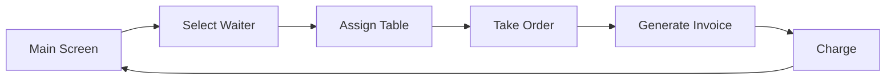

# 🍔 fast-food

Order management system for fast food restaurants developed in Visual Basic .NET with Windows Forms.

## 📋 Description

**fast-food** is a desktop application designed to facilitate order management in fast food restaurants. It allows waiters to take orders efficiently, assign tables, and generate invoices quickly and intuitively.

## ✨ Key Features

- **Table Management**: Manages up to 9 tables simultaneously
- **Waiter Assignment**: Assigns specific waiters to each table
- **Order Taking**: Intuitive interface for selecting menu items
- **Billing System**: Automatically calculates the total bill
- **Visual Status**: Color indicators to identify table status
  - 🟡 Beige: Available table
  - 🟢 Green: Occupied table with assigned waiter

## 🍽️ Available Menu

### Main Dishes
- **Simple Chicken** - $6,000
- **Double Chicken** - $10,000
- **Simple Beef** - $5,000
- **Double Beef** - $8,000

### Extras
- **Lettuce** - Free
- **Tomato** - Free
- **Cheese** - $500
- **Sauces** - Free
- **Bacon** - $1,000
- **Fries** - $2,500

### Beverages
- **Returnable 350ml** - $2,000
- **Non-Returnable 600ml** - $1,000
- **7 Ounce Cup** - $700

## 💻 Technologies Used

- **Language**: Visual Basic .NET
- **Framework**: .NET 8.0
- **UI Framework**: Windows Forms
- **IDE**: Visual Studio 2022

## 📁 Project Structure

```
fast-food/
├── Form1.vb (COMIDAS1)      # Main screen - Table management
├── Form2.vb (COMIDAS2)      # Order taking screen
├── Form3.vb (COMIDAS3)      # Billing screen
├── My Project/              # Application configuration
?   ├── Application.myapp
?   ├── Application.Designer.vb
├── fast-food.vbproj         # Project file
├── fast-food.sln            # Visual Studio solution
├── README.md                # Documentation
```

## 🚀 How to Use

### Prerequisites

- Windows 10 or higher
- .NET 8.0 Runtime or SDK installed
- Visual Studio 2022 (for development)

### Installation

1. **Clone the repository:**
   ```bash
   git clone https://github.com/fawer5dev/FastFood.git
   cd fast-food
   ```

2. **Build the project:**
   ```bash
   dotnet build fast-food.sln
   ```

3. **Run the application:**
   ```bash
   dotnet run --project fast-food.vbproj
   ```

### Application Usage

#### 1. Assign Waiter to a Table
- Select a waiter from the dropdown menu
- Click on the desired table button
- Confirm the assignment

#### 2. Take Order
- Once the waiter is assigned, the order screen opens automatically
- Select menu items using checkboxes:
  - **Main dish**: You can only choose one (Chicken or Beef, Simple or Double)
  - **Extras**: You can choose multiple options
  - **Beverage**: Select the desired size
- The order is automatically saved when closing the window

#### 3. Generate Invoice
- Click the "Invoice" button
- Review the order summary and total
- Click "Charge" to process the payment
- Confirm the transaction
- The table will be automatically released

## 🔄 Workflow



## 📸 Screenshots

### Main Screen - Table Management
Manages up to 9 tables with visual availability indicators.

### Order Screen
Intuitive interface for selecting menu items.

### Billing Screen
Displays order summary and total amount to pay.

## ?? Building from Source

```bash
# Restore dependencies
dotnet restore fast-food.sln

# Build in Debug mode
dotnet build fast-food.sln --configuration Debug

# Build in Release mode
dotnet build fast-food.sln --configuration Release

# Run
dotnet run --project fast-food.vbproj
```

## 📝 Technical Notes

- **Namespace**: `fast_food`
- **Main Form**: `COMIDAS1`
- **Storage**: Orders are stored in a two-dimensional array in memory
- **Persistence**: Data is not saved when closing the application

## ⚠️ Known Issues

- The project has 2 minor warnings related to functions that don't return values on all code paths
- Data does not persist between application sessions

## 🤝 Contributing

Contributions are welcome. For major changes:

1. Fork the project
2. Create a branch for your feature (`git checkout -b feature/AmazingFeature`)
3. Commit your changes (`git commit -m 'Add some AmazingFeature'`)
4. Push to the branch (`git push origin feature/AmazingFeature`)
5. Open a Pull Request

## 📄 License

This project is under the MIT License. See the `LICENSE` file for more details.

## ?? Author

**fawer5dev**
- GitHub: [@fawer5dev](https://github.com/fawer5dev)

## 💬 Support

If you have any questions or issues, please open an issue on the GitHub repository.

---

⭐ If this project has been useful to you, please consider giving it a star on GitHub!